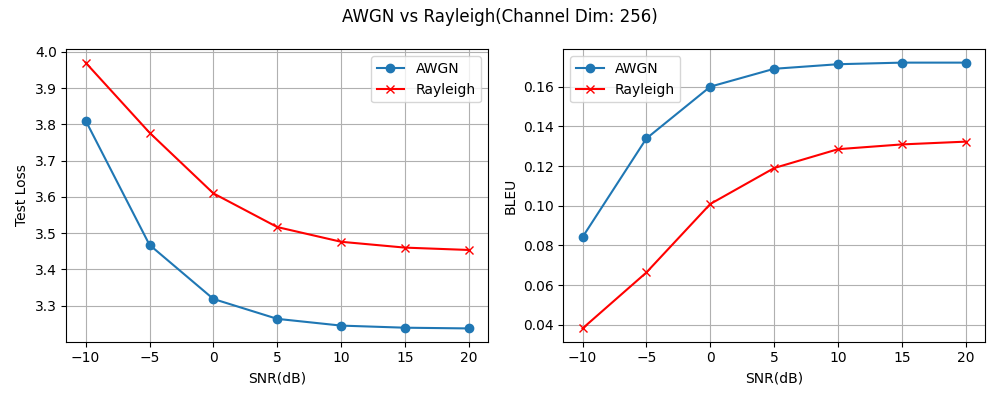

# Semantic Communication — CUC

文本语义通信系统(DeepSC 方向):用 PyTorch 从零实现文本语义通信的 LSTM 端到端 baseline,把语义表示作为受功率约束的信号送过 AWGN / 瑞利衰落信道,系统分析语义恢复质量(BLEU)随信道质量(SNR)的变化。

状态:LSTM 主线全部完成——无信道 baseline → AWGN latent-noise 敏感性分析 → 真信道(channel encoder/decoder + 功率归一化,含 channel_dim 消融)→ Rayleigh 衰落信道对比。下一步升级 Transformer 并改为逐 token 传输,复用同一条信道链做架构对比。

## 核心结果



同配置(Europarl 50k,hidden_dim=512,channel_dim=256,多 SNR 随机训练)下,AWGN 与平坦瑞利衰落(完美 CSI 均衡)的 BLEU:

| SNR (dB) | -10 | -5 | 0 | 5 | 10 | 15 | 20 |
|----------|-----|-----|-----|-----|-----|-----|-----|
| AWGN     | 0.084 | 0.134 | 0.160 | 0.169 | 0.171 | 0.172 | 0.172 |
| Rayleigh | 0.038 | 0.066 | 0.101 | 0.119 | 0.129 | 0.131 | 0.132 |

- 两条曲线均随 SNR 单调上升、高 SNR 饱和:端到端系统学到了「信道质量 ↑ → 语义恢复 ↑」的映射
- Rayleigh 全 SNR 段低于 AWGN:完美 CSI 均衡把衰落除掉,但深衰落符号上的噪声被 1/|h|² 放大,造成不可恢复的信息损失。这与传统通信中瑞利信道差于 AWGN 的经典结论一致,这张图可视为该结论的语义通信版本
- 绝对 BLEU 偏低是当前架构的已知瓶颈,原因与口径见「局限」一节

## 项目目标

把传统通信范式(Shannon Level A,精确传输 bit)换成语义层(Level B,传输含义),研究神经网络能否在带噪信道下学到比传统「信源编码 + 信道编码 + 调制」更鲁棒的端到端文本传输策略。第一版聚焦把整条链路跑通,并产出 BLEU 随 SNR 变化的证据曲线。

## 系统模型

```
源文本 s
  → Embedding + LSTM Encoder      → 语义状态 (hidden, cell)
  → Channel Encoder (FC)          → 发送信号 x
  → 功率归一化 → 物理信道           → AWGN: y = x + n / Rayleigh: y = h·x + n(完美 CSI 均衡)
  → Channel Decoder (FC)          → 恢复语义状态
  → LSTM Decoder + Linear         → 重建文本 ŝ

评估:BLEU(s, ŝ) 随 SNR ∈ [-10, 20] dB 变化
```

(早期还做过直接对 hidden/cell 加噪的 latent-noise 版作为对照,见 `experiments/`。)

## 实验

数据:Europarl 英文语料,过滤保留 4–30 词的句子,采样 50k(及 20k 对照)。train / val / test = 8 / 1 / 1,固定随机种子。

- `experiments/lstm/noiseless/` — 无信道 baseline,对照数据量(20k / 50k)与模型容量(h256 / h512)
- `experiments/lstm/awgn/hidden_only/` — AWGN 加在 hidden state,固定 10 dB 训练 vs 多 SNR 训练
- `experiments/lstm/awgn/hidden_cell/` — AWGN 同时加在 hidden 与 cell state
- `experiments/lstm/awgn/real_channel/` — 真信道(channel encoder/decoder + 功率归一化),channel_dim 消融(32–512)
- `experiments/lstm/Rayleigh/` — 平坦瑞利衰落 + 完美 CSI 均衡(channel_dim=256),与 AWGN 同配置对比

主要观察:

- 多 SNR 训练显著提升低 SNR 条件下的鲁棒性(hidden-only 多 SNR 曲线接近水平)
- cell state 对 LSTM 重构至关重要:同时扰动 hidden 与 cell 时,低 SNR 下退化明显加重
- 真信道下 channel_dim 存在速率-鲁棒性甜点(约 256),并非维度越大越好;堵掉 cell 旁路后曲线才真实反映信道质量

每组实验的设置、结果、失败样例与结论见对应目录的 README(组织方式见 [experiments/README.md](experiments/README.md))。channel_dim 消融对比图:`experiments/lstm/awgn/real_channel/snr_sweep_curve.png`。

## 局限

- 本仓库是「LSTM 语义通信 baseline + 信道鲁棒性分析」,不是完整 DeepSC 复现:无 Transformer、无互信息损失项、无逐 token 传输
- 绝对 BLEU 偏低的主因:整句压成单个 channel_dim 维向量过信道,信道使用量与句长无关,与 DeepSC 逐 token 传输的速率不在一个量级,绝对值不可比。本仓库的价值在曲线形态、消融与 AWGN/Rayleigh 对比
- 无 attention,词向量从零训练,长句、低频词和专有名词的重构较弱(各实验 README 附有失败样例)

## 复现

环境:Python 3.11,`pip install -r requirements.txt`。

```bash
# 1. 数据:下载 Europarl v7 英文语料(https://www.statmt.org/europarl/),
#    解压到 data/raw/europarl-v7/txt/en/,然后过滤采样:
python code/prepare_data.py

# 2. 训练:实验配置集中在 train_lstm.py 顶部的 config
#    (信道类型 AWGN/Rayleigh、channel_dim、输出路径)
python code/train_lstm.py

# 3. 评估:对 best checkpoint 做 SNR 扫描,输出各 SNR 的 Test Loss 与 BLEU
python code/sweep.py
```

BLEU 用 sacrebleu(corpus 级,tokenize=none),取值 0–1;早期实验用自写 BLEU,已与 sacrebleu 校准一致(见 experiments/README.md)。

## 路线

| 阶段 | 内容 | 状态 |
|------|------|------|
| 1. LSTM baseline(无信道) | Seq2Seq 自编码,端到端重建句子,BLEU 评估 | 完成 |
| 2. LSTM + AWGN 信道 | 状态加噪敏感性分析 → 真信道 + 功率归一化;SNR 扫描、channel_dim 消融 | 完成 |
| 3. Rayleigh 衰落信道 | 平坦瑞利 + 完美 CSI 均衡,与 AWGN 同配置对比 | 完成 |
| 4. Transformer(DeepSC 方向) | 编解码升级 Transformer + 逐 token 传输,复用同一条信道链,对比 LSTM | 待启动 |

## 关键文献

1. Xie, Qin, Li, Juang. *Deep Learning Enabled Semantic Communication Systems*. IEEE TSP 2021.(DeepSC)
2. Farsad, Rao, Goldsmith. *Deep Learning for Joint Source-Channel Coding of Text*. ICASSP 2018.
3. O'Shea, Hoydis. *An Introduction to Deep Learning for the Physical Layer*. IEEE TCCN 2017.

## 代码结构

```
.
├── README.md
├── requirements.txt
├── code/            数据、模型、训练、评估、信道
└── experiments/     实验结果,按「模型 / 信道 / 信道实现方式 / 配置」组织
```

技术栈:Python 3.11 · PyTorch · sacrebleu · matplotlib

## Author

杜可正 — 中国传媒大学 信息与通信工程学院
202311103060@mails.cuc.edu.cn
