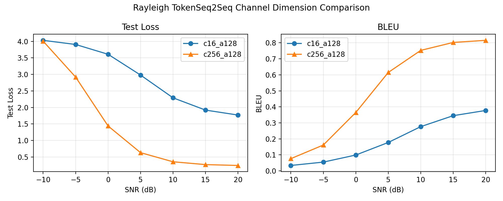
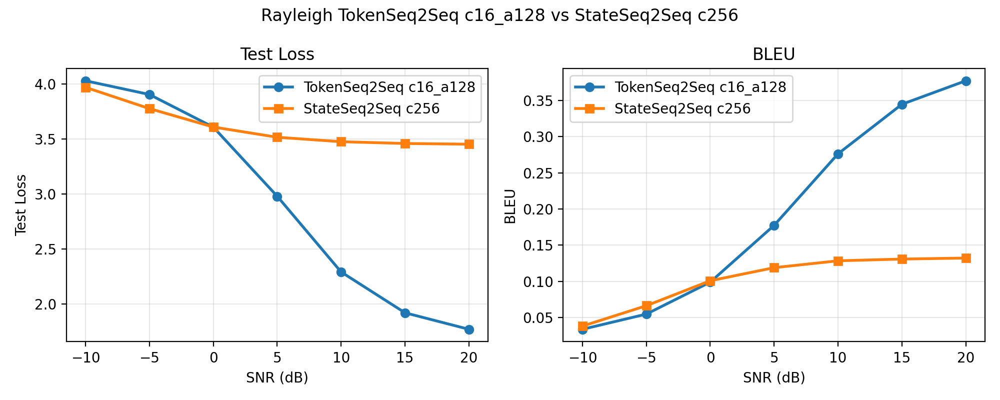
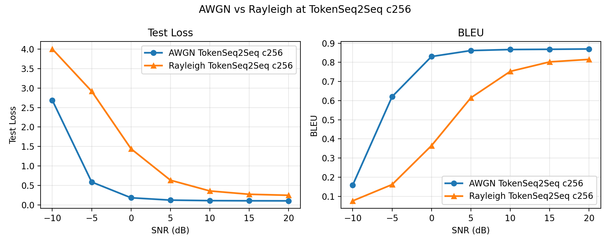

# LSTM 语义通信 · 瑞利衰落下的逐 token 传输

## 实验目的

整句版(stateSeq2Seq)已在 AWGN 与 Rayleigh 下跑通;逐 token 版(tokenSeq2Seq)已在 AWGN 下验证"传输粒度突破整句瓶颈"。本实验把逐 token 链路搬到 Rayleigh 衰落信道,回答两个问题:

1. **跨信道稳健性**:在 AWGN 下成立的"逐 token 胜整句",换到机制完全不同的衰落信道(乘性衰落 + 深衰落)是否仍成立?这是把"传输粒度"这一变量从"AWGN 特性"里摘干净的关键验证。
2. **衰落代价**:在好架构(逐 token)下,Rayleigh 相比 AWGN 的代价有多大、集中在哪个 SNR 段。

只跑 2 组(都 TokenSeq2Seq、attention_hdim=128、channel_type=Rayleigh):c16(带宽对齐整句 c256)与 c256(最好水平)。

## 数据集

数据来自 Europarl English,采样并过滤得到 50,000 条英文句子(保留 token 数 4–30 的句子,去除 Europarl 标签行、空行与括号形式的舞台说明)。与 AWGN 逐 token / stateSeq2Seq 各实验同源、同切分(seed=42),保证跨实验可比。

## 模型

TokenEncoder(LSTM)对每个输入位置输出语义向量 [B,T,H];逐位置经 channel encoder(FC, H→channel_dim)压缩、逐句功率归一化、过 Rayleigh 信道、channel decoder(FC)还原;TokenAttentionDecoder 以自身顶层 hidden 为 query 对接收序列做 additive attention(带 PAD mask)取 context,逐步重建句子。与 AWGN 逐 token 版完全一致,唯一变量是信道层。SOS/EOS 位置同样过信道(帧开销)。详细结构见 [AWGN 逐 token README](../../awgn/real_channel/tokenSeq2Seq/README.md)。

## 信道实现

逐 token 时信道输入是 [B, T, C](T 个 token、每 token C 维)。RayleighChannel 按维度分流,3D 分支在 **C 维内部**相邻配对 (I, Q) 凑复符号([B,T,C] → [B,T,C//2] 复),T 维原样保留——复符号是单个 token 的带宽内复用,与相邻 token 无关。

- h ~ CN(0,1) 每符号独立,完美 CSI 迫零均衡 ŷ = y/h = x + n/h
- N0 = 2/snr_linear:逐句功率归一化把每个实维功率约束为 1,相邻两实维凑一个复符号 ⇒ 复符号能量 = 2,故噪声功率取 2/snr,与整句版(现场测量值 ≈2)同尺
- PAD 位置未在信道出口清零,靠 attention mask 兜底;实测低 SNR(−10/−5 dB)无 NaN,n/h 虽在深衰落时放大但未溢出

其余链路(TokenEncoder、additive attention decoder、channel encoder/decoder、功率归一化)与 AWGN 逐 token 版完全一致,唯一变量是信道层。

## 训练设置

```text
数据:Europarl English 50k(同 AWGN 逐 token)
embedding_dim = 128, hidden_dim = 512, attention_hdim = 128, num_layers = 1
channel_dim ∈ {16, 256}
batch_size = 96, learning_rate = 1e-3, epochs = 20
训练 SNR:每 batch 从 [-10,-5,0,5,10,15,20] 随机取;验证固定 10 dB 选 best
BLEU:sacrebleu(corpus 级,tokenize=none),0–1
```

## 结果

| SNR(dB) | c16 | c256 |
|---|---|---|
| -10 | 0.034 | 0.076 |
| -5  | 0.055 | 0.162 |
| 0   | 0.099 | 0.365 |
| 5   | 0.178 | 0.615 |
| 10  | 0.276 | 0.753 |
| 15  | 0.345 | 0.802 |
| 20  | 0.377 | 0.816 |



c256 全 SNR 段优于 c16,衰落下信道容量更显重要(−5 dB 0.162 vs 0.055)。c16 每 token 仅 8 个复符号、容量太小,封顶在 0.38。

### 跨信道稳健性:速率对齐(token c16 vs 整句 c256)

token c16 平均 304 符号/句,整句 c256 固定 256 符号/句,带宽相当。

| SNR(dB) | token c16 | 整句 c256 |
|---|---|---|
| -10 | 0.034 | 0.038 |
| -5  | 0.055 | 0.066 |
| 0   | 0.099 | 0.101 |
| 5   | 0.178 | 0.119 |
| 10  | 0.276 | 0.129 |
| 15  | 0.345 | 0.131 |
| 20  | 0.377 | 0.132 |



中高 SNR(≥5 dB)token c16 决定性胜出(20 dB 0.377 vs 0.132),带宽相当——说明整句单向量的瓶颈在传输粒度,这一结论在 Rayleigh 与 AWGN 下**都成立**。换一个机制迥异的信道仍复现同一规律,把"粒度优势"从单一信道特性里分离了出来,而非 AWGN 下的巧合。

交叉点:token c16 在 0 dB 仍略低于整句(0.099 vs 0.101),5 dB 才反超。对比 AWGN 下交叉点约在 0 dB(0 dB 时 token 已反超 0.162 vs 0.160),Rayleigh 交叉点**略向右移**(约 1–2 dB),幅度温和。机理:深衰落更重地惩罚低冗余结构——c16 每 token 仅 8 个复符号、无冗余,一次深衰落即毁掉该 token;整句 c256 把全句摊在 128 个复符号上、冗余高,深衰落可被吸收。故 c16 需更高 SNR 才能让容量优势压过整句的鲁棒性。位移温和则因深衰落同时压低了整句,平衡点只小幅移动。

### 衰落代价:AWGN vs Rayleigh(token c256)



| SNR(dB) | AWGN c256 | Rayleigh c256 | 差距 |
|---|---|---|---|
| -10 | 0.159 | 0.076 | 0.083 |
| -5  | 0.621 | 0.162 | 0.459 |
| 0   | 0.830 | 0.365 | 0.465 |
| 5   | 0.862 | 0.615 | 0.247 |
| 10  | 0.867 | 0.753 | 0.114 |
| 20  | 0.870 | 0.816 | 0.054 |

Rayleigh 全 SNR 段劣于 AWGN,差距**在中低段(−5~0 dB)最大(约 0.46)、两头收窄**:极低 SNR 两者都趴在地板上拉不开,高 SNR 两者都接近饱和。这与经典结论一致——AWGN 误码率随 SNR 指数下降,Rayleigh 只随 1/SNR 下降(深衰落导致 E[1/|h|²] 发散,留下一条长尾),所以高 SNR 段瑞利迟迟追不平(20 dB 仍 0.816 vs 0.870)。

## 结论

- **"逐 token 胜整句"跨信道稳健**:该结论在机制迥异的 Rayleigh 与 AWGN 下都成立,把"传输粒度"这一变量从单一信道特性里分离了出来,而非 AWGN 下的巧合。
- **交叉点略向右移**:Rayleigh 下 token c16 反超整句 c256 的 SNR 比 AWGN 略高(约 1–2 dB),因深衰落更重地惩罚低冗余的 c16;位移温和,因深衰落同时压低了整句。
- **衰落代价集中在中低 SNR**:Rayleigh 全段劣于 AWGN,差距在 −5~0 dB 最大(约 0.46)、两头收窄,高 SNR 因深衰落长尾(1/SNR 慢衰)始终追不平。曲线复现了通信领域的经典定性规律。

## 与 DeepSC 招牌结论的关系(诚实口径)

DeepSC 的招牌结论是"低 SNR + Rayleigh 下碾压传统方法(信源编码 + 信道编码)"。本实验**只能部分呼应,不能称为复现**,缺口有三:

1. **没有传统方法对照**:本工作只做了语义系统内部对比(粒度、信道维度、信道类型),未跑 Huffman/Brotli + RS/Turbo 基线,因此无从谈"碾压传统"——"碾压"是相对结论,缺对照物则该结论不成立。这是最关键的缺口,列为后续工作。
2. **架构不是 Transformer**:本系统是 LSTM + 加性注意力(additive attention)的 baseline,DeepSC 是 Transformer。注意力机制不等于 Transformer。
3. **无 MI loss**:本系统只用交叉熵,DeepSC 的双损失(CE + 互信息)未实现。

本实验能诚实声称的是:独立搭建的语义通信链路在 Rayleigh 下复现了通信领域的经典定性规律(衰落全段劣于 AWGN、深衰落长尾、低 SNR 退化更重),并验证了"逐 token 粒度突破整句瓶颈"跨 AWGN/Rayleigh 稳健。定位为"LSTM 语义通信 baseline 的信道鲁棒性分析",非 DeepSC 复现。

## 下一步

- 传统信源信道编码基线对照(补上缺口 1,才有资格谈 semantic vs traditional)
- LSTM → Transformer(DeepSC 架构),复用本条已就位的 AWGN/Rayleigh 信道链,做 LSTM vs Transformer 对比;先读透 DeepSC 论文再动手
