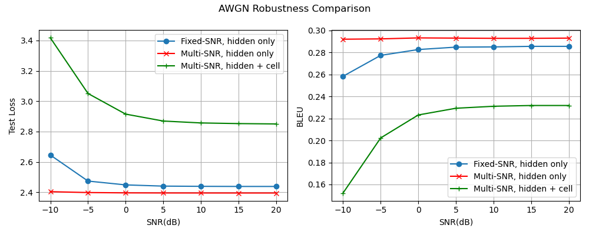

# LSTM AWGN hidden + cell 多 SNR 训练实验（50k, hidden_dim=512）

## 实验目的

前面的 AWGN 实验只在 LSTM Encoder 输出的 hidden state 上加入噪声。本实验进一步把 AWGN 噪声同时加到 hidden state 和 cell state 上，观察更完整地扰动 LSTM 状态后，句子重构性能会发生什么变化。

LSTM Encoder 输出给 Decoder 的并不只有 hidden state，还有 cell state。因此，如果只对 hidden state 加噪，信道扰动是不完整的。本实验可以看作是在 hidden-only AWGN 实验之后，对 LSTM 状态信道建模的一次补充。

当前链路可以表示为：

```text
原始句子 -> LSTM Encoder -> hidden state + cell state
                         -> AWGN 噪声
                         -> LSTM Decoder -> 重构句子
```

## 数据集

数据来自 Europarl English，从中采样并过滤得到 50,000 条英文句子。

主要过滤规则：

- 保留 token 数量在 4 到 30 之间的句子
- 去除 Europarl 标签行
- 去除空行和括号形式的舞台说明

本次实验使用的 processed 数据文件：

```text
data/processed/europarl_en_50k.txt
```

## 模型

模型使用 LSTM Encoder-Decoder。

Encoder 将输入句子编码为 hidden state 和 cell state；AWGN 噪声同时加在 hidden state 和 cell state 上；Decoder 使用加噪后的状态重构原句。

当前版本没有 attention，也没有 Transformer。

## 训练设置

```text
embedding_dim = 128
hidden_dim = 512
num_layers = 1
batch_size = 96
learning_rate = 1e-3
epochs = 20
```

训练阶段每个 batch 从以下 SNR 列表中随机选择一个值：

```text
train_snr_list = [-10, -5, 0, 5, 10, 15, 20]
```

验证阶段固定在 10 dB 下计算 val_loss，用于选择 best checkpoint。这个设置方便和之前的 hidden-only 多 SNR 实验对比，但也意味着 val_loss 只代表 10 dB 条件下的验证表现。

## 训练结果

```text
best_epoch = 10
best_val_loss = 2.8738
```

和 hidden-only 多 SNR 实验相比，hidden + cell 同时加噪后的 best_val_loss 明显更高，说明直接扰动 cell state 会显著增加重构难度。

## SNR Sweep

使用 best checkpoint，在不同 SNR 条件下进行测试：

```text
SNR(dB) | Test Loss | BLEU
-10     | 3.4168    | 0.1522
-5      | 3.0508    | 0.2023
0       | 2.9150    | 0.2232
5       | 2.8694    | 0.2293
10      | 2.8569    | 0.2311
15      | 2.8526    | 0.2318
20      | 2.8503    | 0.2318
```



## BLEU 指标说明:手写实现 → sacrebleu 校准

上面表格里的 BLEU 最初由项目自写的 `compute_bleu` 计算(corpus 级、4-gram、带 brevity penalty)。为了让数值与 DeepSC 等文献可比、也避免自写实现被质疑,后续统一改用标准库 **sacrebleu**(corpus 级,`tokenize="none"`,与原手写口径一致,按空格切词)。

校准结论:在相同预测上,手写 BLEU 与 sacrebleu 数学等价——无信道实验两者逐位相等(差约 1e-17),AWGN 各组差异 ≤ 0.0013(来自重新解码时的随机噪声,不是指标差异)。因此上方结论与曲线在标准指标下同样成立。

- 本组的 sacrebleu 标准值见同目录 `sacrebleu_results.txt`(与旧值并排)
- 三组 AWGN 的 sacrebleu 对比曲线见 `experiments/lstm/awgn/bleu_snr_sacrebleu.png`

## 与 hidden-only 多 SNR 的对比

hidden-only 多 SNR 实验中，AWGN 只作用在 hidden state 上；本实验中，AWGN 同时作用在 hidden state 和 cell state 上。

对比结果非常明显：

```text
hidden-only multi-SNR, -10 dB: BLEU = 0.2921
hidden+cell multi-SNR, -10 dB: BLEU = 0.1522

hidden-only multi-SNR, 20 dB: BLEU = 0.2931
hidden+cell multi-SNR, 20 dB: BLEU = 0.2318
```

从 Test Loss 看，hidden + cell 加噪在所有 SNR 下都明显高于 hidden-only 加噪；从 BLEU 看，hidden + cell 加噪在所有 SNR 下都明显低于 hidden-only 加噪。

这说明 cell state 对 LSTM Decoder 的句子重构非常关键。cell state 可以理解为 LSTM 的长期记忆状态，里面保存了对后续重构有用的上下文信息。直接对 cell state 加 AWGN 噪声，会破坏这些记忆信息，因此 Decoder 更难恢复出原句。

## 结果理解

这个实验不能简单说明 hidden + cell 方案“不好”。更准确的说法是：在当前这种直接对 hidden state 和 cell state 加 AWGN 的简单方式下，模型性能明显下降。

真实通信系统中的信道并不一定等价于“直接对 LSTM 的 hidden 和 cell 都加噪”。hidden state 和 cell state 是模型内部状态，不一定都应该被看作实际传输的信号。因此，本实验更像是一个对 LSTM 状态敏感性的分析：它说明 cell state 被扰动后，LSTM 重构能力会明显受损。

## 结论

cell state 对 LSTM 句子重构至关重要。相比只扰动 hidden state，同时扰动 hidden state 和 cell state 会显著破坏模型的重构能力，尤其在低 SNR 条件下退化更明显。

这也说明前面的 hidden-only AWGN 实验是一种较温和的信道扰动，而 hidden + cell AWGN 是更强、更严格的状态扰动设置。

## 下一步

后续可以继续尝试：

- 对 hidden state 和 cell state 做归一化后再加噪，减少状态尺度差异带来的影响
- 对 cell state 做更充分的抗噪训练
- 引入 attention 或 Transformer，减少模型对单个 LSTM cell state 的依赖
- 进一步区分“模型内部状态扰动”和“真实信道传输信号扰动”

其中最后一点已在 `real_channel` 实验中实现：在 Encoder 和 Decoder 之间加入 channel encoder/decoder 与功率归一化，把语义当作真正受功率约束的发送信号过信道，而不再直接对内部状态加噪。详见 `experiments/lstm/awgn/real_channel/`。
