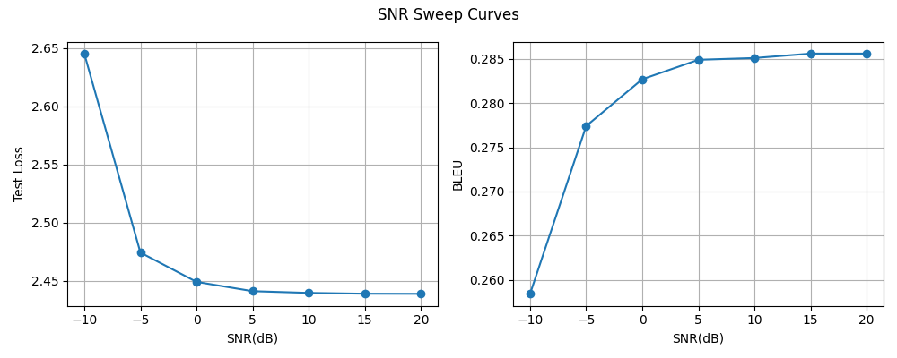

# LSTM AWGN hidden-only 句子重构实验（50k, hidden_dim=512, SNR=10 dB）

## 实验目的

本实验在 50k 数据量、hidden_dim=512 不变的前提下，加入 AWGN 信道。

目标是观察：在相同训练数据下，加入噪声后，句子重构性能相比无噪声基线的变化。

当前任务是加入 AWGN 信道噪声（只在 hidden state 上加入噪声）：

```text
原始句子 -> LSTM Encoder -> 语义状态 -> AWGN噪声 -> LSTM Decoder -> 重构句子
```

## 数据集

数据来自 Europarl English，从中采样并过滤得到 50,000 条英文句子。

主要过滤规则：

- 保留 token 数量在 4 到 30 之间的句子
- 去除 Europarl 标签行
- 去除空行和括号形式的舞台说明

本次实验使用的 processed 数据文件：

```text
data/processed/europarl_en_50k.txt
```

## 模型

模型使用 LSTM Encoder-Decoder。

Encoder 将输入句子编码为 hidden state 和 cell state；Decoder 使用这些状态重构原句。

当前版本没有 attention。

## 训练设置

```text
embedding_dim = 128
hidden_dim = 512
num_layers = 1
batch_size = 96
learning_rate = 1e-3
epochs = 20
snr_db = 10
```

## 实验结果

```text
best_epoch = 10
best_val_loss = 2.4545
test_loss = 2.4398
test_bleu = 0.2856
```

BLEU 分数在 0 到 1 之间，越接近 1 表示模型生成的句子和参考句子越接近。

与无噪声版相比：

```text
50k_h512 test_loss = 2.4322, test_BLEU = 0.2867
awgn_hidden_only_50k_h512 test_loss = 2.4398, test_BLEU = 0.2856
```

与不加入噪声版相比，加入噪声后，test_loss略微升高，BLEU略微下降，但下降幅度不大，说明经过训练后，模型有了一定的抗噪声性能，且与无噪声的性能差异较小。

## 结论

10 dB 下 AWGN 结果和无噪声结果接近，当时判断是 hidden-level 表征对轻度噪声有一定鲁棒性。

> 补注（后续认知更新）：后来的 hidden_cell 实验才发现，本实验只对 hidden 加噪、cell 干净直传，Decoder 能靠这条未受扰的 cell 通路恢复大部分内容——这也是结果接近无噪的重要原因。两个因素（hidden 表征的抗噪 + cell 旁路）共同作用，写本实验时尚未意识到 cell 的影响。低 SNR 下仍有明显退化，见下面的 SNR sweep。

## SNR Sweep

```text
SNR(dB) | Test Loss | BLEU
-10     | 2.6454    | 0.2584
-5      | 2.4742    | 0.2774
0       | 2.4490    | 0.2827
5       | 2.4410    | 0.2849
10      | 2.4395    | 0.2851
15      | 2.4388    | 0.2856
20      | 2.4387    | 0.2856
```



SNR sweep 结果显示，随着 SNR 从 -10 dB 提高到 20 dB，test loss 总体下降，BLEU 总体上升，符合信道质量提升后重构性能变好的预期。

低 SNR 区间的影响更明显：-10 dB 时 test_loss 升高到 2.6454，BLEU 下降到 0.2584；当 SNR 提高到 -5 dB 后，BLEU 恢复到 0.2774。0 dB 之后，性能变化幅度变小，并逐渐接近无噪声 baseline。

这说明当前 LSTM baseline 在 hidden state 加 AWGN 的设定下，对中高 SNR 噪声具有一定鲁棒性，但在极低 SNR 条件下仍会出现明显性能退化。

## 下一步

后续可以尝试多 SNR 训练，或者在 hidden state 和 cell state 上同时加入噪声，观察模型在更强信道扰动下的重构性能。

这两个方向都已完成：多 SNR 训练见 `../multi_snr_50k_h512/`，hidden + cell 同时加噪见 `../../hidden_cell/multi_snr_50k_h512/`。

> 实现补注（2026-06-11）：本实验对内部状态直接加噪、无功率归一化，AWGNChannel 的 signal_power 未 detach 在此设置下有微弱影响；影响面分析见 [experiments/README.md](../../../../README.md) 的「信道实现细节」——本组结论为同实现 A/B 对照，不受影响。
