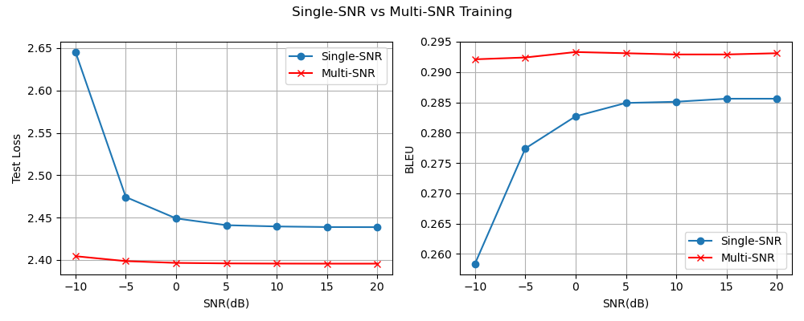

# LSTM AWGN hidden-only 多 SNR 训练实验（50k, hidden_dim=512）

## 实验目的

本实验在前一个 AWGN 10 dB 实验的基础上，将训练阶段的固定 SNR 改成多 SNR 随机采样。

前一个实验中，每个 batch 都在固定的 10 dB 条件下训练；本实验中，每个 batch 会从一个 SNR 列表中随机选择一个信噪比。这样做的目的是观察：让模型在训练阶段见过多种信道质量后，是否能提升它在不同 SNR 条件下的句子重构鲁棒性。

当前信道仍然是简化版 AWGN 信道，只在 Encoder 输出的 hidden state 上加入噪声：

```text
原始句子 -> LSTM Encoder -> hidden state -> AWGN 噪声 -> LSTM Decoder -> 重构句子
```

## 数据集

数据来自 Europarl English，从中采样并过滤得到 50,000 条英文句子。

主要过滤规则：

- 保留 token 数量在 4 到 30 之间的句子
- 去除 Europarl 标签行
- 去除空行和括号形式的舞台说明

本次实验使用的 processed 数据文件：

```text
data/processed/europarl_en_50k.txt
```

## 模型

模型使用 LSTM Encoder-Decoder。

Encoder 将输入句子编码为 hidden state 和 cell state；AWGN 噪声只加在 hidden state 上；Decoder 使用加噪后的 hidden state 和原始 cell state 重构句子。

当前版本没有 attention，也没有 Transformer。

## 训练设置

```text
embedding_dim = 128
hidden_dim = 512
num_layers = 1
batch_size = 96
learning_rate = 1e-3
epochs = 20
```

训练阶段每个 batch 从以下 SNR 列表中随机选择一个值：

```text
train_snr_list = [-10, -5, 0, 5, 10, 15, 20]
```

验证阶段仍然固定在 10 dB 下计算 val_loss，用于选择 best checkpoint。这样可以和前一个固定 10 dB 训练实验保持可比。不过这个 val_loss 只代表 10 dB 条件下的验证表现，不能完全代表模型在所有 SNR 下的平均鲁棒性。

## 训练结果

```text
best_epoch = 10
best_val_loss = 2.4155
```

epoch 10 之后，train loss 继续下降，但 val loss 开始回升，说明模型开始出现过拟合。因此后续评估使用 epoch 10 的 best checkpoint。

## SNR Sweep

使用 best checkpoint，在不同 SNR 条件下进行测试：

```text
SNR(dB) | Test Loss | BLEU
-10     | 2.4044    | 0.2921
-5      | 2.3986    | 0.2924
0       | 2.3965    | 0.2933
5       | 2.3959    | 0.2931
10      | 2.3957    | 0.2929
15      | 2.3956    | 0.2929
20      | 2.3956    | 0.2931
```



## 与固定 10 dB 训练的对比

固定 10 dB 训练模型在低 SNR 下退化更明显：

```text
single-SNR -10 dB: BLEU = 0.2584
multi-SNR  -10 dB: BLEU = 0.2921
```

multi-SNR 训练模型在所有测试 SNR 下都取得了更低的 test loss 和更高的 BLEU。尤其在 -10 dB 这种低信噪比条件下，提升最明显。

这说明模型在训练阶段接触多个 SNR 后，学到了对不同噪声强度更稳定的表示，因此具备更强的抗噪能力。

不过这个结论需要谨慎表述：当前对比说明 multi-SNR 训练在本实验设置下提升了 AWGN 噪声条件下的重构性能，但不能直接说明它在所有任务、所有信道模型、或完全无噪声场景下都一定更好。

## 结论

multi-SNR 曲线在整个测试区间几乎水平，BLEU 始终稳定在 0.293 左右，即使在 -10 dB 也没有明显退化。这与固定 SNR 训练形成对比——后者在低 SNR 下会明显下降。原因见下文。

当前实验只在 hidden state 上加入噪声，没有对 cell state 加噪。因此 Encoder 输出并没有被完全扰动，实验结论对应的是一种简化版 hidden-level AWGN 信道。

值得强调的是，曲线之所以几乎水平、且始终接近无噪水平，是两个因素共同作用的结果：multi-SNR 训练让模型对各档噪声都鲁棒，而 cell 未加噪这条干净旁路让低 SNR 下的语义信息依然存活。换句话说，multi-SNR 训练只能把曲线压平到「信息物理上还活着」的程度——这里 cell 干净、信息没丢，所以能压到全平。作为对照，后续 hidden+cell 同时加噪的实验同样用 multi-SNR 训练，但因为没有这条旁路，低 SNR 下信息被噪声破坏，曲线就不再水平、明显下降。可见「曲线平」= multi-SNR 鲁棒性 ×（低 SNR 信息是否还存活），两者缺一不可。

## 下一步

下一步可以在 cell state 上也加入 AWGN 噪声，观察同时扰动 hidden state 和 cell state 后，模型在不同 SNR 条件下的重构性能是否会进一步下降。

> 实现补注（2026-06-11）：本实验对内部状态直接加噪、无功率归一化，AWGNChannel 的 signal_power 未 detach 在此设置下有微弱影响；影响面分析见 [experiments/README.md](../../../../README.md) 的「信道实现细节」——本组结论为同实现 A/B 对照，不受影响。
