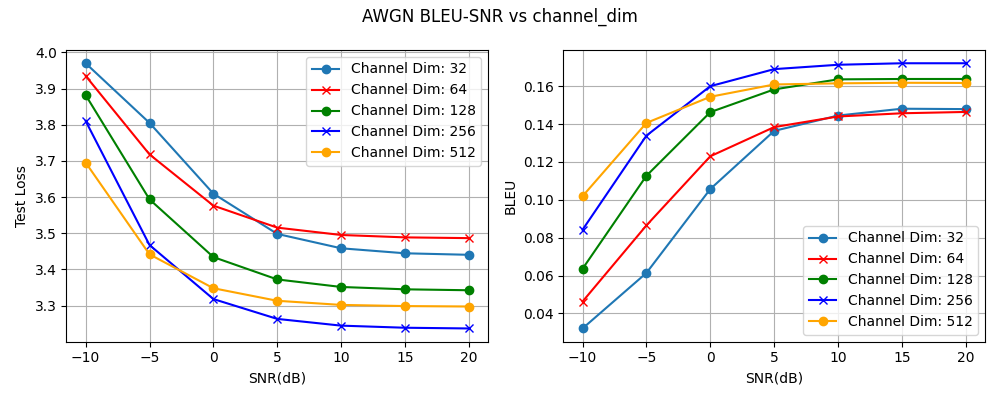

# LSTM 语义通信 · 真信道(channel encoder/decoder + 功率归一化)与 channel_dim 消融

## 实验目的

之前的 AWGN 实验都是直接对 LSTM 的 hidden/cell 状态加噪,并没有经过信道编码,本质上只是对模型内部状态的扰动,不能算信号真正经过了信道。本实验把链路升级为真正的信道传输:语义状态先经过信道编码(FC)映射成一段受功率约束的发送信号,过 AWGN 信道加噪后,再由信道解码(FC)还原。这一版才符合通信范式。

在此基础上,本实验扫描不同的 channel_dim(发送信号维度,即传输速率),考察速率与鲁棒性的取舍。

当前链路可以表示为:

```text
源文本 -> LSTM Encoder -> (hidden, cell)
       -> 拼接压平 -> Channel Encoder(FC) -> 发送信号 x
       -> 功率归一化 -> AWGN 信道 -> Channel Decoder(FC)
       -> 拆回 (hidden, cell) -> LSTM Decoder -> 重建句子
```

## 数据集

数据来自 Europarl English,从中采样并过滤得到 50,000 条英文句子。

主要过滤规则:

- 保留 token 数量在 4 到 30 之间的句子
- 去除 Europarl 标签行
- 去除空行和括号形式的舞台说明

本次实验使用的 processed 数据文件:

```text
data/processed/europarl_en_50k.txt
```

## 模型

模型在 LSTM Encoder-Decoder 之间插入了信道编解码模块。Encoder 输出的 hidden 和 cell 被拼接压平成一个向量,经 Channel Encoder(全连接层)映射到 channel_dim 维的发送信号,做功率归一化后过 AWGN 信道,再由 Channel Decoder(全连接层)还原,拆回 hidden 和 cell 交给 Decoder。

这里有两个关键设计。其一,hidden 和 cell 一起经过信道。之前只对 hidden 加噪、cell 干净直传,等于留了一条未被污染的旁路——decoder 能靠干净的 cell 恢复不少内容,信道对语义状态的扰动并不完整。把 hidden 和 cell 一起送进信道后,这条旁路被堵上,全部语义都经过信道,结果才真实反映信道质量。(这条旁路对 BLEU-SNR 曲线的具体影响,以及单 SNR 与多 SNR 训练下表现的差别,见 hidden_only 实验的 README。)其二,功率归一化给发射端一个固定的功率预算,使 SNR 对应一个标准、可复现的物理条件(对应 OShea / DeepSC 的能量约束),也促使模型把信息编码进信号的形状而非幅度。

当前版本没有 attention,也没有 Transformer。

## 训练设置

```text
embedding_dim = 128
hidden_dim = 512
num_layers = 1
batch_size = 96
learning_rate = 1e-3
epochs = 20
```

训练阶段每个 batch 从 SNR 列表 [-10, -5, 0, 5, 10, 15, 20] 中随机取一个值;验证阶段固定在 10 dB 选择 best checkpoint。channel_dim 分别取 32 / 64 / 128 / 256 / 512,其余设置完全一致,只改这一个变量以保证可比。

BLEU 用 sacrebleu(corpus 级,tokenize=none)计算,取值 0 到 1。

## SNR Sweep(以 channel_dim=128 为例)

使用 best checkpoint(epoch 10)在不同 SNR 下测试:

```text
SNR(dB) | Test Loss | BLEU
-10     | 3.8819    | 0.0636
-5      | 3.5936    | 0.1127
0       | 3.4341    | 0.1463
5       | 3.3723    | 0.1583
10      | 3.3515    | 0.1636
15      | 3.3450    | 0.1638
20      | 3.3424    | 0.1638
```
对比曲线：

各 channel_dim 的完整结果见各自目录下的 `snr_sweep_results.txt`

所有 channel_dim 的 BLEU 都随 SNR 单调上升、高 SNR 饱和,低 SNR 明显退化,说明信道确实起了作用。

## channel_dim 消融:速率与鲁棒性

channel_dim 是发送信号的维度,也就是传输速率、占用的信道资源(不是计算快慢)。消融结果呈现三种情形。

维度太小(32 / 64)时,瓶颈过窄,信息装不下,各 SNR 下 BLEU 都偏低。维度大(512)时冗余更多,在极低 SNR(-10 dB)下略有优势,但维度更大也更难训练,高 SNR 下没有额外收益。综合来看 256 表现最好:高 SNR 段 BLEU 最高(约 0.17)、Test Loss 最低,只在极低 SNR 略逊于 512。

可见速率与鲁棒性之间存在一个甜点,本设置下大致落在 128 到 256 之间(256 略优),并非维度越大越好。512 在高 SNR 反而略差,推测与参数更多、优化更难有关,机理未严格验证。

## 与之前 latent-noise 版的对比

本版高 SNR 的 BLEU(channel_dim=128 约 0.16)低于之前的 latent-noise 实验,但这不是退步,关键要分清和哪一版比:

- 与 hidden+cell 版(约 0.23)比:两者都扰动了完整的 hidden + cell,差距只来自本版多出的信道编解码有损瓶颈(把 1024 维语义压到 channel_dim 再还原)。
- 与 hidden-only 版(约 0.29)比:那一版只对 hidden 加噪、cell 干净直传,占了旁路的便宜、接近无噪,本就不是公平对照;差距里既有上面的瓶颈,也有这条旁路带来的虚高。

两种差距都是"把语义当作受功率约束的信号、完整地过信道"所付的代价。本版才符合现实通信设定。

## 结论

加入信道编解码与功率归一化后,模型实现了真正意义上的"语义经信道传输",BLEU-SNR 曲线随信道质量单调变化,信道扰动有效。channel_dim 的消融揭示了速率与鲁棒性的折中,最佳点在 256 附近。

需要说明的是,本实验的定性是"LSTM 语义通信,信号经功率受限 AWGN 信道传输",并非完整 DeepSC 复现(仍缺 Transformer、MI loss、瑞利信道)。

## 下一步

- 固定 channel_dim = 256,加入瑞利衰落信道 y = h·x + n,对比 AWGN 与 Rayleigh 下的表现
- 后续把 LSTM 编解码升级为 Transformer(DeepSC),复用本条信道链,做 LSTM vs Transformer 对比
