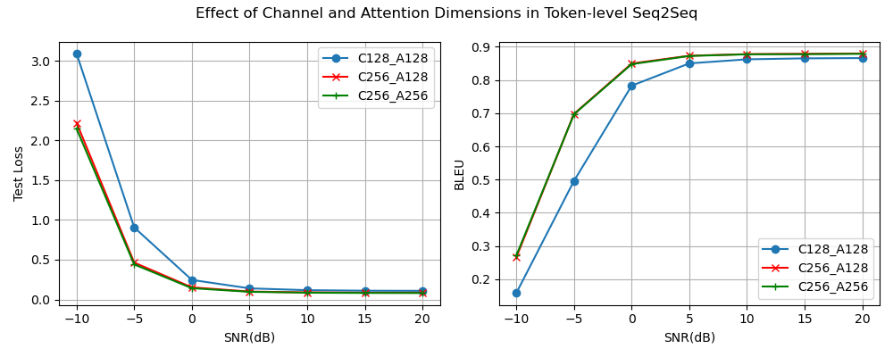
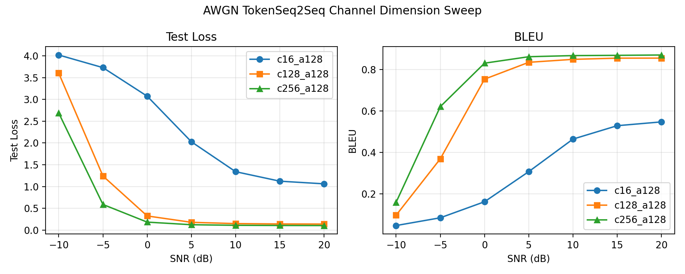
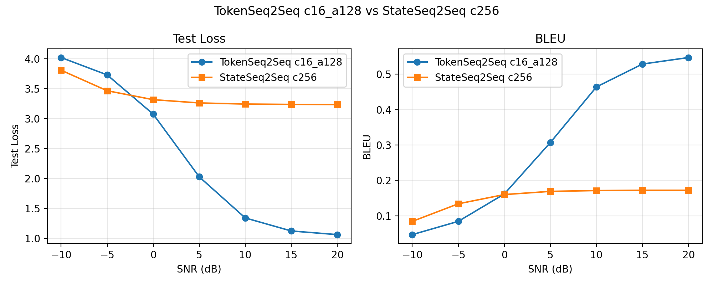
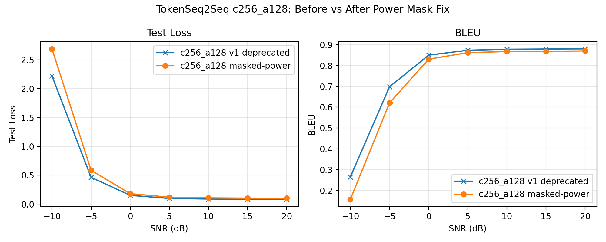

# LSTM 语义通信 · 逐 token 传输(attention decoder)与速率对齐实验

## 实验目的

stateSeq2Seq 实验线把整句压成单个 channel_dim 维向量过信道,这个"整句单向量"瓶颈被认为是绝对 BLEU 偏低(c256 高 SNR 约 0.17)的主因。本实验线把传输粒度从整句改为逐 token:encoder 对每个输入位置输出一个语义向量,每个向量各自经信道编码、过信道、信道解码,decoder 通过 attention 从接收序列中取信息重建句子。这与 DeepSC 的传输粒度一致。

要回答的问题有两个:

1. 粒度变细后性能提升多少(对照 stateSeq2Seq 同 channel_dim);
2. 提升来自粒度本身还是来自带宽——逐 token 的总符号数是 句长 × channel_dim,远大于整句版固定的 256。为分离这两个变量,加入 channel_dim=16 的速率对齐组(见下)。

## 链路

```text
源文本 -> TokenEncoder(LSTM) -> 每个位置的语义向量 [B, T, H]
       -> Channel Encoder(FC, H -> channel_dim, 逐位置)
       -> 逐句功率归一化(只统计真实 token, PAD 位置置零)
       -> AWGN 信道 -> Channel Decoder(FC, 逐位置)
       -> 接收序列 [B, T, H]
       -> Attention Decoder(LSTM + additive attention, 带 PAD mask) -> 重建句子
```

## 模型

与 stateSeq2Seq 的区别有三处:

- **TokenEncoder** 返回每个输入位置的 LSTM output 序列,而不是最终 hidden/cell。
- **信道编解码逐位置作用**:每个 token 的 H=512 维语义向量独立压到 channel_dim 维。功率约束是逐句的:每句真实 token 位置的平均功率归一化为 1,PAD 位置不发射(置零)。逐句(而非逐 token)归一化保留了跨 token 分配功率的自由度。AWGN 信道按"输入已功率归一化"的契约直接由 SNR 推噪声方差,不再现场测量信号功率。
- **TokenAttentionDecoder**:decoder 不再接收 hidden/cell(初始状态为零),每步以自身顶层 hidden 为 query,对接收序列做 additive attention 取 context,与词嵌入拼接后输入 LSTM。attention 带 PAD mask。

SOS 与 EOS 位置同样过信道,属于帧开销(类比帧头帧尾):测试集句长(含 SOS/EOS)平均 19.0,最短 6,最长 32。

## 速率对齐:为什么有 c16

整句版每句固定 256 符号;逐 token c256 平均每句 19 × 256 ≈ 4860 符号,带宽是整句版的 19 倍,直接比较混淆了"粒度"与"带宽"两个变量。c16 组平均每句 19 × 16 = 304 符号,只比整句版多 19%。这 19% 的影响可由整句版自己的消融定上界:c256 → c512 带宽翻倍,BLEU 增益可忽略,故 +19% 不足以解释量级上的性能差距。若 c16 仍远超整句版,则"瓶颈在传输粒度"成立。

c16 同时对齐 DeepSC 的每词 16 维设定,可作为后续 Transformer 版与 DeepSC 对表的锚点。

## 训练设置

```text
embedding_dim = 128
hidden_dim = 512
attention_hdim = 128
num_layers = 1
batch_size = 96
learning_rate = 1e-3
epochs = 20
channel_dim ∈ {16, 128, 256}
```

训练阶段每个 batch 从 SNR 列表 [-10, -5, 0, 5, 10, 15, 20] 随机取值;验证固定 10 dB 选 best checkpoint;BLEU 用 sacrebleu(corpus 级,tokenize=none,0–1)。除 channel_dim 外所有设置一致。

## 第一批结果作废说明(2026-06-12)

第一批逐 token 实验(c128_a128 / c256_a128 / c256_a256)存在 SNR 标定错误:功率归一化把 PAD 位置算进了均值,信道又按被 PAD 稀释的测量值配噪声,导致真实符号的实际功率约为 T/句长 倍——每句获得 0 到 +7 dB 不等的 SNR 增益(平均约 +2 dB),句子越短虚高越多。曲线整体偏乐观,且 x 轴随句长发散,定量数字不可引用。

三组产物中保留 c256_a256 一组作为样本(目录已加 `_v1_deprecated` 后缀),其余两组已删,数字存档如下(已作废,仅供修复前后对比):

```text
c128_a128                 c256_a128                 c256_a256
SNR  | Loss   | BLEU      SNR  | Loss   | BLEU      SNR  | Loss   | BLEU
-10  | 3.0918 | 0.1583    -10  | 2.2212 | 0.2659    -10  | 2.1477 | 0.2712
-5   | 0.9056 | 0.4962    -5   | 0.4639 | 0.6979    -5   | 0.4408 | 0.6969
0    | 0.2460 | 0.7829    0    | 0.1528 | 0.8497    0    | 0.1422 | 0.8478
5    | 0.1400 | 0.8501    5    | 0.0998 | 0.8731    5    | 0.0968 | 0.8724
10   | 0.1171 | 0.8623    10   | 0.0896 | 0.8779    10   | 0.0855 | 0.8774
15   | 0.1107 | 0.8652    15   | 0.0855 | 0.8790    15   | 0.0825 | 0.8778
20   | 0.1090 | 0.8661    20   | 0.0851 | 0.8799    20   | 0.0815 | 0.8789
```

对应曲线(同样作废,纵轴整体偏乐观、低 SNR 段失真最大):



定性结论经分析仍然成立(各配置吃到的虚高同源,相对比较干净):

- 逐 token 远超整句单向量(高 SNR 0.87+ vs 0.17,差距远非 2 dB 虚高所能解释);
- channel_dim 在低 SNR 敏感(信道容量瓶颈),attention_hdim 不敏感(a128 与 a256 曲线几乎重合——内容不流经打分支路,a 只需足以区分约 30 个源位置)。据此新一轮不再跑 a256。

修复内容(代码已改):归一化只统计真实 token 并将 PAD 置零;AWGN 信道删除现场功率测量,按单位功率契约由 SNR 直接推噪声方差。修复后 c16/c128/c256(a128)三组重训,结果见各子目录。

## 结果

三组均训练 20 epoch、多 SNR 随机训练,best checkpoint 在 10 dB 验证选出,BLEU 为 sacrebleu corpus 级。

### channel_dim 消融(逐 token,a128)

| SNR(dB) | c16 | c128 | c256 |
|---|---|---|---|
| -10 | 0.047 | 0.097 | 0.159 |
| -5  | 0.084 | 0.369 | 0.621 |
| 0   | 0.162 | 0.753 | 0.830 |
| 5   | 0.307 | 0.835 | 0.862 |
| 10  | 0.464 | 0.849 | 0.867 |
| 15  | 0.529 | 0.855 | 0.868 |
| 20  | 0.547 | 0.855 | 0.870 |



c256 全 SNR 段最优,c128 紧随,c16 明显落后。与整句版消融同一规律——channel_dim 即信道容量,低 SNR 越缺容量越吃亏(−5 dB 处 c16/c128/c256 = 0.08/0.37/0.62,差距最大),高 SNR 饱和后 c128 与 c256 接近(0.855 vs 0.870),c16 因每 token 仅 8 个复符号、容量太小,封顶在 0.55。c128→c256 高 SNR 增益已很小(+0.015),折中点同样落在 256 附近。

### 速率对齐:粒度 vs 带宽(token c16 vs 整句 c256)

本实验线的核心对照。token c16 平均 304 符号/句,整句版 c256 固定 256 符号/句,带宽相当(+19%)。

| SNR(dB) | token c16 | 整句 c256 |
|---|---|---|
| -10 | 0.047 | 0.084 |
| -5  | 0.084 | 0.134 |
| 0   | 0.162 | 0.160 |
| 5   | 0.307 | 0.169 |
| 10  | 0.464 | 0.171 |
| 15  | 0.529 | 0.172 |
| 20  | 0.547 | 0.172 |



结论分两段,比初始假设更细:

- **中高 SNR(≥5 dB):粒度决定性胜出。** 20 dB 下 token c16 = 0.547 vs 整句 c256 = 0.172,3.2 倍,而带宽只多 19%。整句单向量把全句压成一个点过信道,容量被自身结构封死在约 0.17;逐 token + attention 让信息分散在多个符号、解码端按需取用,突破了这个瓶颈。这证明整句版的瓶颈在**传输粒度**,不在带宽——19% 的带宽差远不足以解释 3.2 倍差距(整句版 c256→c512 带宽翻倍 BLEU 增益可忽略,见 stateSeq2Seq 消融)。
- **极低 SNR(≤−5 dB):整句单向量反而更抗噪。** −10 dB 下 token c16(0.047)低于整句 c256(0.084)。固定带宽下,整句把全部信息塞进一个 256 维向量,冗余极高、抗噪强,代价是容量封顶;c16 把每个 token 摊到仅 8 个复符号、几无冗余,低 SNR 下被噪声打穿。交叉点在 0 dB 附近。

综合:细化传输粒度是突破容量瓶颈的关键,但在固定带宽、极低 SNR 下要以牺牲单符号冗余为代价;要同时兼顾两端,需提高 channel_dim(c256 在低 SNR 明显好于 c16)。

### 修复前 vs 修复后(c256,功率归一化 mask 修复)

| SNR(dB) | v1(标定有误) | 修复后 |
|---|---|---|
| -10 | 0.265 | 0.159 |
| -5  | 0.697 | 0.621 |
| 0   | 0.850 | 0.830 |
| 5   | 0.873 | 0.862 |
| 10  | 0.878 | 0.867 |
| 15  | 0.878 | 0.868 |
| 20  | 0.876 | 0.870 |



修复后整体略低于 v1,差距集中在低 SNR(−10 dB 0.265→0.159、−5 dB 0.70→0.62),高 SNR 几乎不变(0.88→0.87)。这与上文"作废说明"的机理预测一致:PAD 污染给短句额外功率增益、低 SNR 受益最大、高 SNR 饱和无感。曲线形状验证了对该 bug 影响的事前定量判断。

### 解码样例与病理

c16 在低 SNR 段可见复读、插词、漏 EOS 后续写等现象,属低容量下贪心解码的确定性循环,符合预期;高 SNR 段及 c128/c256 输出基本通顺。各组完整样例见对应目录的 sweep_stdout.log。

## 下一步

- 瑞利衰落信道的逐 token 版(RayleighChannel 尚未适配单位功率契约,改完信道后再跑);
- LSTM 升级 Transformer(DeepSC 架构),复用本条逐 token 信道链,做架构对比。
