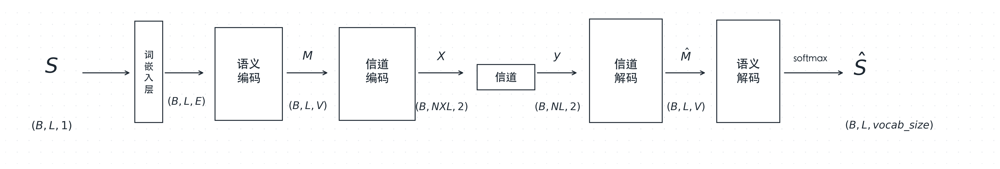

# Xie et al. 2021 — Deep Learning Enabled Semantic Communication Systems (DeepSC)

> **Paper**: H. Xie, Z. Qin, G. Y. Li, B.-H. Juang. _Deep Learning Enabled Semantic Communication Systems_. IEEE Trans. Signal Processing, 2021. (arXiv:2006.10685v3)
> **PDF**: `papers/DeepSC_Xie2021.pdf`
> **读完时间**: 2026-06-15

## 第一遍 — 30 分钟（摸地图）

### 三句话总结

**Abstract**（1.现状 2.提出什么 3.怎么做的 4.证明了什么 5.留了什么坑）

1. 现状：
   1）基于深度学习的端到端通信系统被相继提出，用于融合传统通信系统中各个独立的物理层模块，从而使收发机的联合优化成为可能
   2）NLP 在分析和理解海量文本方面取得巨大成功
2. 提出什么：提出了一种基于深度学习的语义通信系统（DeepSC），用于文本传输；提出了一种新指标：句子相似度，用于准确衡量语义通信的性能
3. 怎么做的：DeepSC 以 Transformer 为基础，目标是通过恢复句子的含义来最大化系统容量、最小化语义误差；并采用迁移学习来保证 DeepSC 能适配不同的通信环境，并加速模型训练过程
4. 证明了什么：与不考虑语义信息交换的传统通信系统相比，DeepSC 对信道变化更加鲁棒，能取得更优的性能，在低 SNR 区间尤为明显
5. 留了什么坑：未提到

**Conclusion**（1.找虽然但是 2.找作者最得意的话 3.找未来方向）

1. 虽然但是：没有虽然但是，全是总结性话语和对比
2. 最得意的话：我们提出的 DeepSC 是文本传输的良好候选方案，尤其是在低 SNR 区间，这对在有限频谱资源下需要连接海量设备的场景可能非常有用
3. 未来方向：基于 DeepSC 开发用于传输多类型的语义信息的模型

### 摸地图三问

1. 这篇论文要解决什么问题？(跟传统通信比，痛点是什么？跟 OShea 那条 E2E 路线又有什么不同？)

   有些新型应用彼此互联，将产生以泽字节量级计的数据量，同时需要在有限的频谱资源上支持海量链接却又要求更低的时延，这给传统的信源-信道编码带来了严峻的挑战。

   跟 OShea / 传统 E2E 的不同：两者都是端到端，但层次不同。OShea 和传统通信在第一层——优化目标是符号/比特的准确传输（比 BER/BLER）；DeepSC 在第二层——优化目标是语义（句子意思）的准确恢复。所以即使部分比特出错、传统系统判为传输失败，只要意思没变 DeepSC 仍算成功——这是它在低 SNR 区间占优的根本原因。

2. 核心方法是什么？(论文造的新词 / 新组件名 — 至少 3 个)

   DeepSC 的原创：
   1. DeepSC 框架——首个基于 Transformer 的文本语义通信收发机（语义编码器 + 信道编码器 + 信道 + 信道解码器 + 语义解码器）
   2. 句子相似度（sentence similarity）——用 BERT 语义向量算的新评价指标，比 BLEU 更贴近"意思"
   3. 语义-信道联合编码 + 双损失（交叉熵 CE + 互信息 MI）——CE 保语义、MI 最大化数据率

3. 实验证明了什么？(Figure 编号 / baseline 名字 / 关键结论一句话)

   DeepSC 对信道变化更加鲁棒，能取得更优的性能，在低 SNR 区间尤为明显，这对在有限频谱资源下需要连接海量设备的场景可能非常有用

---

## 第二遍 — 60-90 分钟（啃方法）

### Q1. Shannon-Weaver 三个层次的通信，DeepSC 做的是哪一层？这一层和传统通信关注的"层"差在哪？

答：第二层：做的是所传符号的语义交换，第二层通信处理的是发射端发出的语义信息以及接受端所理解的含义，即语义通信；而传统通信是第一层，即主要关注符号能否从发射端成功传输到接受端，其准确性主要以比特 or 符号为单位来衡量。第一层关注具体符号/bit，第二层则更关注符号/bit 背后的语义。

### Q2. DeepSC 收发机由哪 4 个模块组成？画出数据流 s → ... → ŝ，标注每个箭头处的张量。

答：语义编码器，信道编码器，信道解码器，语义解码器

### Q3. 这 4 个模块各用什么网络实现？（对照 Table I）

答：

- 语义编码器 = 3层8头 Transformer encoder
- 信道编码器 = 2层全连接(dense)
- 信道解码器 = 2层全连接
- 语义解码器 = 3层8头 Transformer decoder

### Q4. 物理信道在网络里怎么实现？公式 (2) 的 y = hx + n 里 h 和 n 各是什么？为什么信道必须可微？

答：用一个神经网络实现（但本论文实验中用的固定数学公式表达，不参与训练），h是衰减系数，n是加性噪声，如果信道不可微那梯度反向传播的时候就无法传到语义编码器，就会导致整个网络无法训练

### Q5. 总 loss 是什么？两项分别管什么？为什么 MI 项前面是减号？

答：Ltotal = LCE − λ·LMI，LCE管句子的还原程度，LMI管数据速率和容量，λ控制二者比例的超参数，因为MI项的上界是互信息，是我们需要逼近的，所以LMI越大越好，相应的损失函数越小越好，所有前面是减号

### Q6. 为什么训练分两个 phase？（Algorithm 1 / Fig 4）

答：因为这个过程需要一个神经网络T来估计互信息，第一个phase就是在训练T，使它能够有一定估计互信息的能力，然后phase2才是真正的训练，不能同时训练是因为phase2是依托于phase1的，phase2需要T的估计结果。

补充：两个 phase 不是"phase1 一次性训完 T，再 phase2"，而是 `while 未收敛: { 训练 MI 模型 T(phase1); 训练整个网络(phase2) }`——**每一轮外循环里两个 phase 各跑一次，反复交替**，直到收敛/达最大迭代/loss 不再下降。
原因：T 估的是"当前编码器产生的 X,Y"的互信息，而编码器在 phase2 一直在变；若只在开头把 T 训一次，编码器一变 T 就过时、估不准了。所以每轮都用最新的 X,Y 重新校准 T，再用它去训编码器——两者交替前进。

### Q7. 论文为什么要新造一个 "sentence similarity" 指标？它和 BLEU 的本质区别是什么？怎么算的？

答：因为句子相似度才能更好的评估语义通信的效果，他和BLEU的本质区别是，BLEU只看还原了多少原句子，而句子相似度看还原了多少原句的语义，用Bert预训练模型的语义向量余弦相似度来计算。

### Q8. Fig 6 / Fig 7 — DeepSC 在什么条件下赢、什么条件下输？AWGN 和 Rayleigh 两张图结论一样吗？

答：对AWGN信道，DeepSC在低SNR下赢，在高SNR下会输给一些传统方法；对Rayleigh信道，DeepSC在全SNR下都赢

### Q9. 迁移学习在 DeepSC 里解决什么问题？换信道 vs 换知识库，分别冻结/重训哪部分？

答：解决有已经训练好的模型怎么迁移到信道/知识库不同的问题上；换信道的话，冻结语义编解码器，重训信道编解码器；换知识库的话，冻结信道编解码器，重训语义编解码器。

### Q10. MI 估计模型到底带来了什么收益？（Fig 9）

答：MI估计模型提升了互信息，使得模型的学习结果更好，提高了数据速率。
带 MI 模型训练的编码器在SNR=4 dB得到的互信息，约等于不带 MI 模型在SNR=9 dB的互信息，并且 MI 还能当"模型是否有效收敛"的判据。

---

## 连接我的项目（复现导向，重点）

### Q11. DeepSC 跟 OShea 2017 最大的相似点和不同点？

**相似点**：

- 都是端到端通信系统，联合优化收发机
- 都是 autoencoder 骨架（发射机=编码压缩、信道、接收机=解码重建）
- 信道都做成可微层插在中间，让梯度能穿过去训练发射端

**不同点（模块级）**：

| 维度     | OShea 2017                       | DeepSC                                                         |
| -------- | -------------------------------- | -------------------------------------------------------------- |
| 输入粒度 | one-hot 单消息（M 选 1，无序列） | token 序列（句子，L 维 + embedding 层）                        |
| 核心网络 | 全连接 MLP                       | 语义编解码用 Transformer(self-attention)，信道编解码才用 dense |
| 损失     | 单一分类 CE（BER 导向）          | CE + MI 双损失                                                 |
| 输出     | M 类 softmax，选一个消息         | 逐 token 词表 softmax，生成整句序列                            |
| 评价指标 | BER / BLER                       | BLEU + sentence similarity                                     |
| 额外机制 | 无                               | 迁移学习（换信道/换知识库冻结重训）                            |

本质：OShea 是"单符号自编码器"，DeepSC 是"序列(句子)语义传输系统"——即两张流程图并排时"有没有 L 维"的差异。其余差异(Transformer、双损失、序列输出)都从"要处理序列、要保语义"派生。层次差异(第一层 vs 第二层)见摸地图三问 1。

### Q12. 从 OShea autoencoder 改到 DeepSC，架构上要替换哪几个组件？

答：

1. 输入：one-hot 消息 ID → token 序列 + embedding 层（多出 L 维）
2. 编码器：全连接 MLP → Transformer encoder（self-attention + positional encoding）
3. 信道编码器：保留 dense，但要适配序列（逐 token 编成复符号 [B,NL,2]）
4. 解码器：全连接 MLP → Transformer decoder
5. 输出层：M 维 softmax(选消息) → 逐 token 词表 softmax(序列生成)
6. 损失：单一 CE → CE + MI（多一个 MINE 网络 T + 两阶段训练）
7. 指标：BER/BLER → BLEU + sentence similarity

### Q13. baseline 已完成，v2 相对完整 DeepSC 还差哪些？每一项要不要做、为什么？

答：

1. **LSTM → Transformer**：✅ 做（主线）。去循环 + self-attention + positional encoding，复用现有信道链。
2. **信道编解码 单层线性 → 多层 Dense + ReLU**（照 Table I：256→16 / 256→128）：✅ 做（今天读论文发现的差距，低成本提表达力，随 Transformer 一起重训）。
3. **MI loss**：⏸ 暂不做（选做）。Fig 9 省 ~5 dB，但要两阶段交替训练 + MINE 网络；先把 Transformer 主线跑通，行有余力再上。
4. **sentence similarity (BERT)**：⏸ 暂不做（选做）。更贴语义但引入 BERT 依赖；BLEU 已够看曲线趋势。
5. **迁移学习**：⏸ 暂不做。工程亮点，优先级最低。
6. **传统基线对照（Huffman/Brotli + Turbo/RS）**：重要但靠后。缺它无法谈"semantic vs traditional"，但纯通信工程活、无 DL 含量，已决定排在 Transformer 之后。

### Q14. 复现 DeepSC 的关键超参 / 配置，从 Table I 和 Sec V-A 能抄到哪些？

答：

- **数据**：Europarl，~200 万句 / 5300 万词，过滤到 4–30 词，分 train/test
- **Transformer**：3 层、8 头、128 维（encoder + decoder，激活 Linear）
- **信道编码器**：Dense 256(ReLU) → Dense **16**(ReLU)
- **信道解码器**：Dense 256(ReLU) → Dense **128**(ReLU)
- **Prediction Layer**：词表大小，Softmax
- **MI Model (T)**：Dense 256 / 256 / 1（都 ReLU）
- **每词 8 个复符号**（16 units = 8×2，对应 X∈ℝ^{B×NL×2}，N=8）
- **学习率 0.001**（Fig 10/11：0.002 会卡局部最优、MI 恒 0；0.001 才到全局最优）
- **信道**：AWGN + Rayleigh（完美 CSI）
- **λ**：MI 项权重，0 ≤ λ ≤ 1
- **baseline**：JSCC[22]（BLSTM）；传统 = Huffman/5-bit/Brotli 信源 + Turbo/RS 信道 + 8/64/128-QAM

