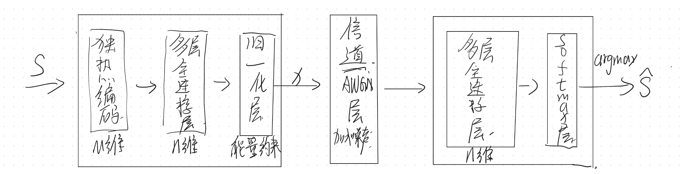

# OShea & Hoydis 2017 — An Introduction to Deep Learning for the Physical Layer

> **Paper**: T. O'Shea, J. Hoydis. _An Introduction to Deep Learning for the Physical Layer_. IEEE TCCN 2017.
> **PDF**: `papers/OShea_DL4PHY_2017.pdf`
> **读完时间**: 2026-05-28 精读完成

---

## 第一遍 — 30 分钟（摸地图）

### 三句话总结

**Abstract**（1.现状 2.提出什么 3.怎么做的 4.证明了什么 5.留了什么坑）

1. 现状：无
2. 提出什么：通过将通信系统视为自编码器，将通信系统设计视为端到端任务，还扩展至多发射机与接收机网络，提出了无线电变压网络（RTNs）
3. 怎么做的：在原始样本上应用卷积神经网络（CNN）进行调制分类实验
4. 证明了什么：准确率与依赖专家特征的传统方案相当
5. 留了什么坑：当前面临的开放性挑战及未来研究方向

**Conclusion**（1.找虽然但是 2.找作者最得意的话 3.找未来方向）

1. 虽然但是：尽管其对长块长度的扩展能力仍面临挑战
2. 最得意的话：我们提出了一种全新的通信建模思路
3. 未来方向：建立基准问题与数据集

### 摸地图三问

1. 这篇论文要解决什么问题？（跟谁对比？传统方法的具体痛点是什么？）

   > 传统方案依赖专家特征，使用深度学习融入通信系统可以不依赖专家特征

2. 核心方法是什么？（论文造的新词 / 新组件名）

   > 将通信系统设计为端到端任务，扩展至多发射机与接收机网络，应用 RTNs 和卷积神经网络

3. 实验证明了什么？（Figure 编号 / 具体 baseline 名字 / 量化结果）

   > 证明了这种方法的 BLER 值极具竞争力，且准确率与依赖专家特征的传统方案相当

---

## 第二遍 — 60-90 分钟（啃方法）

### Q1. 传统通信系统的"模块化"做法有什么局限？

答：不清楚单独优化的处理块能否实现最佳的端到端性能，即局部最优不一定能达到全局最优。

### Q2. Figure 1 — Autoencoder 视角下的通信系统由几部分组成？

### Q3. 把"通信系统"映射成 Autoencoder 后，loss function 是什么？为什么这么选？

答：categorical cross-entropy。因为论文中把通信系统问题视为分类问题，这个损失函数适用于分类问题。

### Q4. AWGN 信道在网络里是怎么"实现"的？反向传播怎么过这一层？

答：加上随机的高斯白噪声，模拟信道的噪声效果。反向传播经过这一层梯度不变，因为是加性噪声。

### Q5. Figure 4 — 网络学到的星座图长什么样？跟 QPSK / 16-QAM 像吗？

答：Figure 4 先显示了 (2,2) 在能量约束下学到的星座为 QPSK。

(2,4) 下根据不同约束学到不同星座：

- 固定能量约束：16PSK
- 平均功率约束：pentagonal/hexagonal 网格（BLER ≈ 16-QAM）

d 子图 (7,4) 用 t-SNE 把含噪 y 投影到 2D，可以看到 16 个簇分得很开，说明有较好抗噪性能。

### Q6. Figure 6 — BLER vs. SNR 曲线，Autoencoder 跟传统方案（Hamming / QAM）谁赢？在什么 SNR 区间赢？

答：

- (1,1) 和 (2,2) 时二者完全重合，说明在低速率下 TS 已是最优策略，AE 自动学到了 TS
- (4,4) 和 (4,8) 时 autoencoder 赢：在较低的 SNR 下，传统方案和 autoencoder 差别不大；但在高 SNR 下，autoencoder 的 BLER 值要低于传统方案

### Q7. Section IV — Modulation classification 跟 III 的 Autoencoder 是同一个网络吗？

答：不是。调制分类只学习了 RX 端，输入是固定的不同调制的序列；而 Autoencoder 学习了 TX 和 RX 端，自发对输入信号编码、最后对输入信号解码，两个任务是完全不同的。且调制分类用到了 CNN，而 Autoencoder 只用到了 NN。

### Q8. Section V — Radio Transformer Network (RTN) 是干什么的？为什么需要它？

答：RTN (Radio Transformer Network) 把通信物理先验塞进 NN，共有 3 部分：

1. 参数估计器 g_ω（NN）：从 y 估计频偏 Δf̂ / 定时 τ̂ 等
2. 参数化变换 t（固定物理公式，可微）：用 g_ω 估出的参数对 y 做校正（如 y' = y · exp(−j2π Δf̂ t)）
3. 判别 NN：对校正后的信号做识别/译码

为什么需要它：目标不是估准物理参数本身，而是端到端最小化最终 loss（参数可能"故意估不准"以利后端判别）。

---

## 我能借鉴的具体点

1. **信道作为网络中间的可微层**：AWGN 写成 y = x + n，噪声独立采样、∂y/∂x = 1，梯度原样穿过，端到端反传才成立 → `code/channel.py` 的 `AWGNChannel`
2. **发射端功率/能量约束**：归一化层给发射信号固定功率预算，SNR 才有标准物理含义，且该层必须留在计算图内（不能 no_grad） → `code/channel.py` 的 `power_normalize`
3. **"指标 vs SNR 曲线"的评估范式**：把传统通信的 BLER-SNR 曲线传统迁移到学习系统上 → 本项目所有实验的 BLEU-SNR sweep
